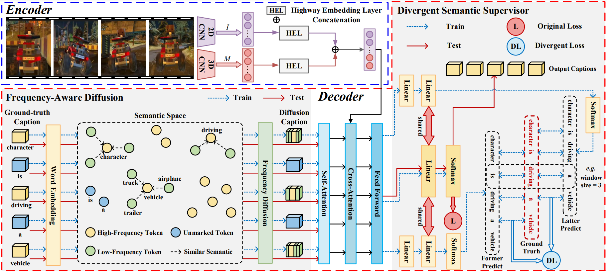

# Refined Semantic Enhancement towards Frequency Diffusion for Video Captioning
Code for Refined Semantic Enhancement towards Frequency Diffusion for Video Captioning published at AAAI 2023.

PyTorch Implementation of the paper:

> **Refined Semantic Enhancement towards Frequency Diffusion for Video Captioning**
>
> Xian Zhong, Zipeng Li, Shuqin Chen, Kui Jiang, Chen Chen, Mang Ye.
>
> [[arXiv](https://arxiv.org/abs/2211.15076)] or [[aaai.org](https://arxiv.org/abs/2211.15076)]

## Main Contribution
1. Emphasis on token imbalance to enhance the refined semantics for video captioning.
2. In the form of diffusion to learn infrequent tokens to alleviate the long-tailed problem.
3. Balancing different frequent tokens by leveraging distinctive semantics.

## Methodology
As shown in Fig. 2, our overall framework follows the encoder-decoder structure. During the training process, Frequency-Aware Diffusion (FAD) encourages the model to add low-frequency token noise to learn its semantics. Then the diffusion features of tokens are fused with the corresponding visual features according to the cross-attention mechanism. At the head of the decoder, Divergent Semantic Supervisor (DSS) obtains distinctive semantic features by updating the gradient that adapts to the token itself. In the testing phase, only the original Transformer architecture is retained to generate captions.

<div style="color:orange;  display: inline-block; color: black; ">Figure 2. Overview of the proposed RSFD architecture. It mainly consists of the encoder in the top-left box and the decoder with FAD and DSS modules in another box. In the training phase, FAD promotes the model comprehending the refined information by mapping the ground-truth caption to the semantic space and fusing it in frequency diffusion. DSS supervises the central word to obtain its distinctive semantics. In the testing phase, only the transformer-based parts are implemented for sentence generation.</div>


## Environment

```
conda create -n RSFD python==3.7
conda activate RSFD
pip install torch==1.6.0+cu101 torchvision==0.7.0+cu101 -f https://download.pytorch.org/whl/torch_stable.html
```

## Installation

```
git clone https://github.com/lzp870/RSFD.git
cd RSFD
```

## Download datasets

Organize corpora and extracted features under `VC_data/` in in [GoogleDrive](https://drive.google.com/drive/folders/1oieaYBCNw5sk3fi1cyorYxcMg2LIVXr8?usp=sharing) or [BaiduYun](https://pan.baidu.com/s/1AP3jfSOPcbHHktmHPXeo-w)
```bash
VC_data
└── MSRVTT
        ├── feats
        │   ├── image_resnet101_imagenet_fps_max60.hdf5
        │   └── motion_resnext101_kinetics_duration16_overlap8.hdf5
        ├── info_corpus.pkl
        └── refs.pkl
└── Youtube2Text
        ├── feats
        │   ├── image_resnet101_imagenet_fps_max60.hdf
        │   └── motion_resnext101_kinetics_duration16_overlap8.hdf5
        ├── info_corpus.pkl
        └── refs.pkl
```

## Training 

```
python train.py --default --dataset MSRVTT --method ARB
python train.py --default --dataset MSVD --method ARB
```

## Testing 
```
python translate.py --default --dataset MSRVTT --method ARB
python translate.py --default --dataset MSVD --method ARB
```


## Citation
If our research and this repository are helpful to your work, please **[★star]** this repo and **[cite]** with:

```
@article{RSFD,
  author    = {Xian Zhong and
               Zipeng Li and
               Shuqin Chen and
               Kui Jiang and
               Chen Chen and
               Mang Ye},
  title     = {Refined Semantic Enhancement towards Frequency Diffusion for Video
               Captioning},
  journal   = {CoRR},
  volume    = {abs/2211.15076},
  year      = {2022},
}
```

## Acknowledgements
Code of the encoder part is based on [yangbang18/Non-Autoregressive-Video-Captioning](https://github.com/yangbang18/Non-Autoregressive-Video-Captioning).
